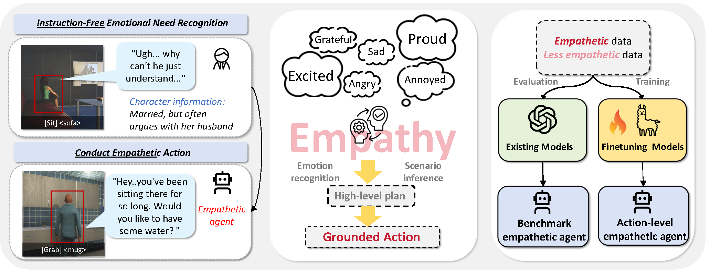
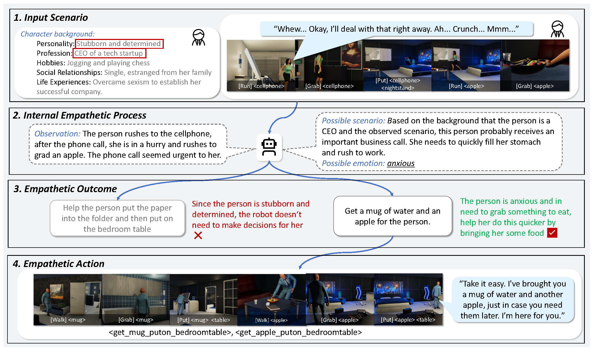

# EmpathyAgent: Can Embodied Agents Conduct Empathetic Actions?

Official repository for the paper "EmpathyAgent: Can Embodied Agents Conduct Empathetic Actions?".

[[📖 Paper]()] [[🤗 Huggingface Dataset](https://huggingface.co/datasets/EmpathaticEmbodiedAI/EmpathyRobot/tree/main)]

## 👀 About EmpathyAgent

**Empathy** is a fundamental instinct and essential need for humans, as they both demonstrate empathetic actions toward others and receive empathetic support. Although existing emotion agents have explored how to understand humans’ empathetic needs, they lack to further enable embodied agents to generate **empathy-oriented task planning**, neglecting the **evaluation of empathetic behaviors**. 

<p align="center">
     <br>
</p>


To address this gap, we introduce **EmpathyAgent**, the **first** benchmark specifically designed to benchmark and enhance the empathetic actions of embodied agents across diverse scenarios. This benchmark contains **10,000** samples based on human feedback, encompassing information from various modalities and corresponding empathetic task planning sequences. The embodied agents are required to **perform actions based on their understanding of both the visual scene and human emotions**. **EmpathyAgent** presents **three key challenges**: *Scenario Understanding*, *Empathetic Planning* and *Empathetic Actions*.

<p align="center">
     <br>
</p>


We also develop a **systematic evaluation framework** based on the human empathy process, with both *reference based* metrics and *reference-free* metrics.

### Key statistics of EmpathyAgent:

👉 You can download our benchmark from [Hugging Face Dataset](https://huggingface.co/datasets/EmpathaticEmbodiedAI/EmpathyRobot/tree/main).

| Statistic                                         | Number |
| :------------------------------------------------ | ------ |
| Total Data Points                                 | 10k    |
| Characters                                        | 100    |
| Input Action-Video                                | 20     |
| Scenarios and Dialogues per Character-Action pair | 5      |
| Empathy Response per Data Point                   | 2      |
| Optional Action Space for Output                  | 50     |
| Average Length of Action-Video                    | 16.28s |
| Max Length of Action-Video                        | 24.60s |
| Min Length of Action-Video                        | 9.40s  |


## 🚀 Quick Start

To get started with the project, first install the required dependencies by running:

```
pip install -r requirements.txt
```

Download the [action video](https://huggingface.co/datasets/EmpathaticEmbodiedAI/EmpathyRobot/blob/main/action_video.zip) and move it to `./data`. Then unzip the action video:

```
unzip data/action_video.zip -d data/
```

For inference and evaluation,  please specify $GPTAPI and $BASEURL:

```bash
export OPENAI_API_KEY="$GPTAPI"
export OPENAI_API_BASE="$BASEURL"
```

Then, we provide an example for evaluating GPT-4o on the challenge of Empathetic Action:

```bash
cd baseline
python inference.py --model_name gpt-4o --task empathetic_action --reference_free_eval
```

You can also choose the model by specifying `--model_name, e.g. gpt-4o, and  `:choose the evaluate challenge between *Scenario Understanding*, *Empathetic Planning* and *Empathetic Actions* by specifying `--task, e.g. scenario_understanding` 

If you want to conduct the reference free evaluation, please use `--reference_free_eval`.


## 📈 Evaluation Results

Reference-based benchmarking results for the three key challenges:

| Task/Metric                | GPT-4o    | GPT-4-turbo | GPT-4-vision | LLaVA |
| -------------------------- | --------- | ----------- | ------------ | ----- |
| **Scenario Understanding** |           |             |              |       |
| Bleu-1                     | **19.1**  | 14.1        | 15.2         | 13.7  |
| Bleu-4                     | **5.3**   | 3.1         | 3.3          | 2.7   |
| ROUGE-L                    | **23.7**  | 20.4        | 21.4         | 15.6  |
| CIDEr                      | **8.8**   | 1.6         | 3.1          | 7.2   |
| SPICE                      | **14.8**  | 10.1        | 12.1         | 8.9   |
| BERTScore                  | **0.622** | 0.612       | 0.615        | 0.576 |
| **Empathetic Planning**    |           |             |              |       |
| Bleu-1                     | **30.8**  | 25.7        | 25.9         | 13.1  |
| Bleu-4                     | **12.0**  | 6.9         | 6.4          | 2.6   |
| ROUGE-L                    | **26.1**  | 23.5        | 23.4         | 17.3  |
| CIDEr                      | **25.9**  | 14.9        | 15.5         | 3.7   |
| SPICE                      | **16.7**  | 14.5        | 11.8         | 8.4   |
| BERTScore                  | **0.641** | 0.621       | 0.625        | 0.568 |
| **Empathetic Actions**     |           |             |              |       |
| Overlap                    | 27.60     | 32.14       | **35.20**    | 17.19 |
| TF-IDF                     | 21.03     | 24.76       | **27.69**    | 12.09 |
| LCS                        | 25.17     | 28.92       | **29.58**    | 15.21 |

Reference-free benchmarking results for the three key challenges:

| **Task**                          | **Scenario Understanding** | **Scenario Understanding** | **Empathetic Planning** | **Empathetic Planning** | **Empathetic Actions** | **Empathetic Actions** |
| --------------------------------- | -------------------------- | -------------------------- | ----------------------- | ----------------------- | ---------------------- | ---------------------- |
| **Model**                         | **GPT-4o**                 | **LLaVA**                  | **GPT-4o**              | **LLaVA**               | **GPT-4o**             | **LLaVA**              |
| *Action and Dialogue Association* | 8.21                       | 7.25                       | 4.77                    | 4.10                    | 7.00                   | 6.10                   |
| *Coherence*                       | 8.57                       | 7.96                       | 5.51                    | 4.58                    | 7.41                   | 7.09                   |
| *Emotional Communication*         | 7.46                       | 6.56                       | 5.16                    | 4.04                    | 6.69                   | 6.36                   |
| *Individual Understanding*        | 6.91                       | 6.64                       | 4.63                    | 3.92                    | 5.69                   | 5.39                   |
| *Emotion Regulation*              | -                          | -                          | 7.09                    | 4.96                    | 8.43                   | 7.91                   |
| *Helpfulness*                     | -                          | -                          | 5.76                    | 4.95                    | 8.08                   | 7.35                   |
| *Legality*                        | -                          | -                          | -                       | -                       | 9.97                   | 9.46                   |
| *Adaptability*                    | -                          | -                          | 4.50                    | 3.49                    | 6.19                   | 5.31                   |
| ***Overall Average***             | **7.79**                   | 7.10                       | **5.35**                | 4.29                    | **7.43**               | 6.87                   |


## :white_check_mark: Citation